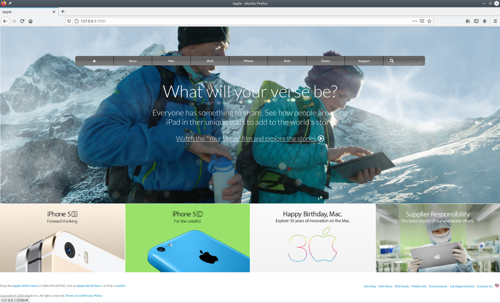

# Apple.com clone
This project aims to clone apple.com's homepage using HTML, CSS, flexbox, grid, backgrounds and gradients 



## Built With

- HTML 
- CSS (flexbox and grid)
- Background (images and gradient)

## Live Demo

[Live Demo Link](https://raw.githack.com/VanessaAoki/apple-clone/feature/index.html) 


## Getting Started

To get a local copy up and running follow these simple example steps.

### Prerequisites

- Live Server plugin for Visual Studio Code 

### Setup

1- Clone the repository
```
https://github.com/VanessaAoki/apple-clone
```

2- Open the folder on VS Code, right click the index.html file and click on "Open With Live Server"

3- Everything should be running by now. 


## Authors

👤 **Vanessa Aoki**

- GitHub: [@VanessaAoki](https://github.com/VanessaAoki)
- Twitter: [@VanessaSAoki](https://twitter.com/VanessaSAoki)
- Linkedin: [Vanessa Aoki](https://www.linkedin.com/in/vanessasaoki/)

👤 **Kimotho Kamau**

- GitHub: [@kimothokamau](https://github.com/kimothokamau)
- Twitter: [@kimothokk](https://twitter.com/kimothokk)

## 🤝 Contributing

Contributions, issues, and feature requests are welcome!

Feel free to check the [issues page](https://github.com/VanessaAoki/apple-clone/issues)

## Show your support

Give a ⭐️ if you like this project!

## 📝 License

This project is [MIT](.License.md)
